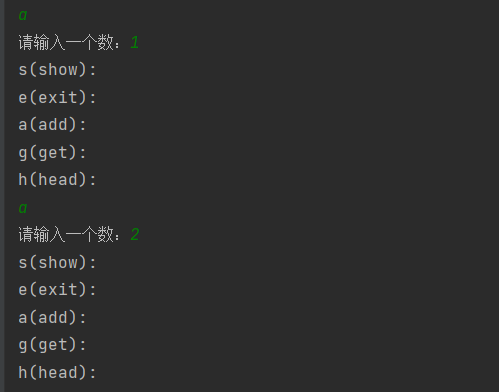
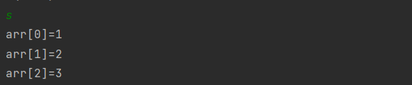
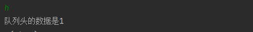

# 数组队列 #

## 背景

* 数据结构——数组队列 

* 博主以b站尚硅谷Java数据结构与算法课进行学习

  <!--more-->

## 概念 ##

* 队列是一个有序列表，可以用数组或链表实现。
* 遵循先入先出原则：
  * 先存入的数据，先取出，后存入的数据后取出。

## 问题 ##

* 使用数组模拟队列实现
* 相关数据：
  * maxSize：该队列的最大容量
  * front：头指针，指向队列头部，指向队列头的前一个位置，随数据的输出而改变，初始值为-1
  * rear： 尾指针，指向队列尾部，指向队列尾，随数据的输入而改变，初始值为-1

## 步骤 ##

* 创建 ArrayQueue类

  * 代码实现：

    ```java
    class ArrayQueue{
        private int maxSize;//表示数组的最大容量
        private int front;//队列头
        private int rear;//队列尾
        private int[] arr;//存储队列的数组
        }
    public ArrayQueue(int arrMaxSize){
        maxSize = arrMaxSize;
        arr = new int[maxSize];
        front = -1;//指向队列头部，指向队列头的前一个位置
        rear = -1;// 指向队列尾部，指向队列尾
    }
    ```

* **addQueue方法：将数据存入队列中**

  * 思路分析：

    * rear == front 时队列为空

    * 将尾指针往后移：rear+1

    * rear == maxSize-1时 队列满不能再添加数据

    * 代码实现：

      ```java
        public void addQueue(int n){
              //判断队列是否满
              if(isFull()){
                  System.out.println("队列满了，不能再添加数据");
                  return;
              }
              arr[++rear] = n;//先对rear+1，再进行赋值
          }
      ```

* isFull方法： 判断队列是否满

  * 代码实现：

    ```java
    public boolean isFull(){
        return rear == maxSize-1;
    }
    ```

    

* isEmpty方法： 判断队列是否空

  * 代码实现：

    ```java
    public boolean isEmpty(){
        return rear == front;
    }
    ```

* getQueue方法：获取队列,出队列

  * 代码实现：

    ```java
       public int getQueue(){
            //判断队列是否为空
            if(isEmpty()){
                //抛出异常
                throw new RuntimeException("队列空，不能取数据");
            }
            front++;//后移
            return arr[front];
        }
    ```

* showQueue方法：显示队列所有数据

  * 代码实现：

    ```java
    public void showQueue(){
        if (isEmpty()){
            System.out.println("队列空没有数据");
        }
        for (int i = 0;i< arr.length;i++) {
            System.out.printf("arr[%d]=%d\n",i,arr[i]);
        }
     }
    ```

* headQueue方法： 显示队列头数据

  * 代码实现：

    ```java
    public int headQueue(){
        if (isEmpty()) {
            throw new RuntimeException("队列空没有数据");
        }
        return arr[front+1];
    }
    ```

* 主类ArrayQueueDemo方法： 测试

  * 代码实现：

    ```java
    public class ArrayQueueDemo {
        public static void main(String[] args) {
            ArrayQueue arrayQueue = new ArrayQueue(3);
            char key = ' ';
            Scanner scanner = new Scanner(System.in);
            boolean loop = true;
            while(loop){
                System.out.println("s(show):");
                System.out.println("e(exit):");
                System.out.println("a(add):");
                System.out.println("g(get):");
                System.out.println("h(head):");
                key =scanner.next().charAt(0);//接收一个字符
                switch(key){
                    case's':
                        arrayQueue.showQueue();
                        break;
                    case'a':
                        System.out.print("请输入一个数：");
                        int value = scanner.nextInt();
                        arrayQueue.addQueue(value);
                        break;
                    case'g':
                        try{
                         int res = arrayQueue.getQueue();
                            System.out.printf("取出的数据是%d\n",res);
                        }catch(Exception e){
                            System.out.println(e.getMessage());
                        }
                        break;
                    case'h':
                        try{
                            int res = arrayQueue.headQueue();
                            System.out.printf("队列头的数据是%d\n",res);
                        }catch(Exception e){
                            System.out.println(e.getMessage());
                    }
                        break;
                    case'e':
                        scanner.close();
                        loop = false;
                        break;
                }
            }
            System.out.println("退出");
        }
    ```

## 运行结果图 ##

* addQueue方法：

  

* showQueue方法：

  

* headQueue方法：

  

* getQueue方法：

  

* exit方法：

  
