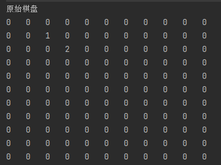
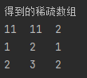
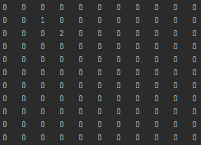

# 稀疏数组

## 背景

* 数据结构——稀疏数组

* 博主以b站尚硅谷Java数据结构与算法课进行学习

  <!--more-->

## 概念

* 稀疏数组是一种用于存储和处理多维数组中大部分元素为0（或者同一个值）的数据结构。
* 稀疏数组的处理方法:  
  * 记录数组一共有几行几列，有几个不同的值。
  * 把不同值的元素的行、列和值分别存入稀疏数组中。

## 问题      

* 将原始二维数组转化为稀疏数组
  * 原始二维数组（11*11）
  * 稀疏数组（3*3）

$$
\begin{matrix}
0&0&0&0&0&0&0&0&0&0&0\\
0&0&1&0&0&0&0&0&0&0&0\\
0&0&0&2&0&0&0&0&0&0&0\\
0&0&0&0&0&0&0&0&0&0&0\\
0&0&0&0&0&0&0&0&0&0&0\\
0&0&0&0&0&0&0&0&0&0&0\\
0&0&0&0&0&0&0&0&0&0&0\\
0&0&0&0&0&0&0&0&0&0&0\\
0&0&0&0&0&0&0&0&0&0&0\\
0&0&0&0&0&0&0&0&0&0&0\\
0&0&0&0&0&0&0&0&0&0&0\\
\end{matrix}
$$

| 行   | 列   | 值   |
| ---- | ---- | ---- |
| 11   | 11   | 2    |
| 1    | 2    | 1    |
| 2    | 3    | 2    |

## 步骤

1. 先创建一个11*11的二维数组，0：表示没有棋子，1：表示黑子，2：表示白子

   * * 代码实现

     ```java
     int chessArr1[][] = new int[11][11];
             chessArr1[1][2] = 1;
             chessArr1[2][3] = 2;
             //输出原始棋盘
             System.out.println("原始棋盘");
             for(int[] row : chessArr1){
                 for(int date : row){
                     System.out.printf("%d\t",date);
                 }
                 System.out.println();
             }
     ```

2. 将二维数据转为稀疏数组

   * 2.1.先遍历二维数组，得到非0个数。

     * 代码实现

       ```java
          int sum = 0;
               for (int i = 0; i < 11; i++) {
                   for (int j = 0; j < 11; j++) {
                       if(chessArr1[i][j] != 0){
                           sum++;
                       }
                   }
               }
       ```

   * 2.2.创建稀疏数组，给稀疏数组赋值

     * 代码实现

       ```java
       int sparseArr[][] = new int [sum+1][3];
       sparseArr[0][0] = 11;
       sparseArr[0][1] = 11;
       sparseArr[0][2] = sum;
       ```

   * 2.3.遍历二维数组，将其中非0数赋给稀疏数组

     * 代码实现

       ```java
       int count = 0;//记录第几个非0数
       for (int i = 0; i < 11; i++) {
           for (int j = 0; j < 11; j++) {
               if(chessArr1[i][j] != 0){
                   count++;
                   sparseArr[count][0] = i;
                   sparseArr[count][1] = j;
                   sparseArr[count][2] = chessArr1[i][j];
               }
           }
       ```

     * 

   * 2.4.输出稀疏数组

     * 代码实现

       ```java
        System.out.println("得到的稀疏数组");
               for (int i = 0; i < sparseArr.length; i++) {
                   System.out.printf("%d\t%d\t%d\t\n",sparseArr[i][0],sparseArr[i][1],sparseArr[i][2]);
               }
               System.out.println();
       ```

3. 将稀疏数组恢复成二维数组

   * 3.1.先读取稀疏数组第一行，创建原始的二维数组

     * 代码实现

       ```java
       int chessArr2[][] = new int[sparseArr[0][0]][sparseArr[0][1]];
       ```

   * 3.2.再读取稀疏数组后几行，赋给原始的二维数组

     * 代码实现

       ```java
       for (int i = 1; i< sparseArr.length ; i++) {//因为第一行是用来创建原始二维数组,所以从第二行开始
           chessArr2[sparseArr[i][0]][sparseArr[i][2]] = sparseArr[i][2];
       }
       ```

   * 3.3.恢复后的棋盘

     * 代码实现

       ```java
       for(int[] row : chessArr1){
           for(int date : row){
               System.out.printf("%d\t",date);
           }
           System.out.println();
       }
       ```

## 运行结果图

* 原始棋盘图
  * 
  
* 稀疏数组图
  * 
  
* 恢复棋盘图
  * 
  
    


